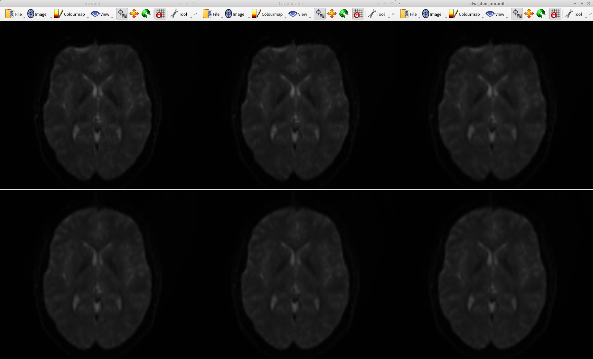

# dview


### Summary
This script is a simplified version of syncview; instead of selecting an image via GUI, you can give it an image name (or image names) as argument. Pathname expansion can be used (for example dwi*) 
to open multiple images with the same display conditions. It is mainly designed for pre- and post-processing of diffusion weighted images (distortion correction, bias field correction, etc.), so the display conditions are suitable for them.

### Prerequisite
MRtrix3

### Usage

dview image_name

### example

```
dview dwi*
```

